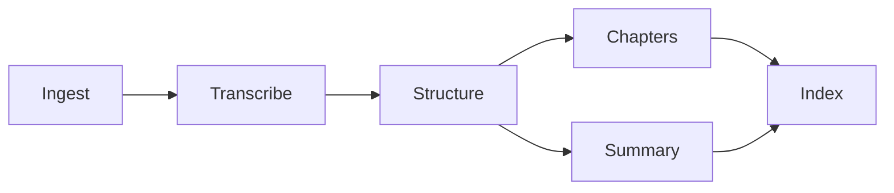

<h1 align="center">VideoMind</h1>

<p align="center">
  
  
  
  
  
  
  
</p>

<p align="center">
  Understand any video without watching it.
</p>

<p align="center">
  <code>transcript</code> · <code>semantic chapters</code> · <code>grounded summary</code> · <code>Q&amp;A over the transcript</code>
</p>

---

## What this repo is

This is the **local, DVC-driven experimentation pipeline** for VideoMind — where each stage is developed, tested, and iterated on individually, with caching so you're not re-running expensive steps you've already done. It runs from the command line, stage by stage, and writes everything it produces to disk so you can inspect it directly.

(There's a separate FastAPI + web UI version of this same pipeline for live, interactive use — this repo is the dev/experimentation side, not that one.)

## What it does

Given a video URL or a local audio/video file, the pipeline produces:

- **A full transcript** — word-timed, saved as JSON
- **Semantic chapters** — boundaries drawn where the conversation actually shifts topic, not sliced at fixed time intervals
- **A grounded summary** — a TL;DR and key points, map-reduced across the transcript, with numbers checked against the source rather than restated as fact when they look inconsistent
- **A searchable embedding index** — for retrieval-augmented Q&A over the transcript

Every stage's output, every prompt sent to the LLM, and every run's logs are all on disk, in this repo, for inspection.

## Pipeline



Each stage is a DVC stage in `dvc.yaml`, backed by a `src/components/` class and run via a small script in `scripts/`. DVC tracks each stage's dependencies and caches its output, so `dvc repro` only reruns what's actually changed.

## Project structure

```
scripts/                    One entrypoint script per DVC stage — what dvc.yaml actually runs
src/
  components/                One class per pipeline stage (ingestion, transcription, chapters, summary, embedding)
  pipeline/                   Orchestrates components into VideoPipeline / QAPipeline
  entity/                      Config and artifact dataclasses — every tunable value lives here, not hardcoded in components
  utils/                       Shared helpers (JSON I/O, HF embedding calls, etc.)
  prompts.py                   Every LLM prompt used anywhere in the pipeline, centralized in one place
  constants.py                 Every tunable constant — paths, model names, retry counts, batch sizes
dvc.yaml                      DVC pipeline definition — stages, dependencies, outputs
dvc.lock                      DVC's record of the last successful run (auto-generated, do not hand-edit)
artifact/                     Every stage's output, per run — audio, chunks, transcript, timestamps, summary, embeddings
logs/                          Timestamped run logs, one line per pipeline event, rotated automatically
tests/                        Unit tests for the trickier logic (retry/salvage behavior, mainly)
```

`artifact/` and `logs/` are generated, not hand-written — they're what running the pipeline actually produces, and they're what you'd look at to see exactly what happened on a given run: what got transcribed, what prompt was sent, what came back, what got retried.

## Setup

```bash
git clone <your-repo-url>
cd VideoMind
python -m venv .venv
source .venv/bin/activate   # .venv\Scripts\activate on Windows
pip install -r requirements.txt
```

### Environment variables

| Variable | Required | Notes |
|---|---|---|
| `GROQ_API_KEY` | Yes | Transcription + LLM calls. Free tier, no credit card. |
| `HF_TOKEN` | Yes | Embeddings via Hugging Face Inference API. Free, no credit card. |
| `VIDEO_URL` | Yes, for the ingestion stage | Set in `src/constants.py` or overridden via env — the video this run processes. |

## Running the pipeline

Run every stage in order, with caching:
```bash
dvc repro
```

Run a single stage (and whatever it depends on):
```bash
dvc repro <stage-name>
# e.g. dvc repro summary
```

Force a rerun of a stage even if DVC thinks nothing changed:
```bash
dvc repro <stage-name> --force
```

See the pipeline's dependency graph:
```bash
dvc dag
```

Each stage's script lives in `scripts/` and can also be run directly for quick iteration without going through DVC:
```bash
python -m scripts.run_timestamps
```

## Prompts

Every prompt the pipeline sends to an LLM lives in `src/prompts.py`, nowhere else — chapter-boundary detection, batch summarization, final summary combination, and Q&A. If you're tuning output quality, this is the one file to edit; nothing prompt-related is inlined in the component classes.

## Logs

`logs/` holds a rotating, timestamped log of every pipeline run — every stage entered/exited, every retry attempt, every salvage recovery on a failed LLM call. Useful for figuring out exactly where a run slowed down or failed, without needing to reproduce it.

## Known limitations

- This is the experimentation pipeline — it runs stage-by-stage from the command line, not as a live service
- `artifact/` and `logs/` grow with every run; nothing here prunes old runs automatically
- Running on free-tier APIs means free-tier rate limits apply
- YouTube extraction can be blocked from cloud hosting environments — this repo assumes local/trusted-IP execution and doesn't include the cookie/PO-token workarounds the live API version needs

https://github.com/NikhilGarg21/VideoMind-RAG-Pipeline-Local-Experiment-.git